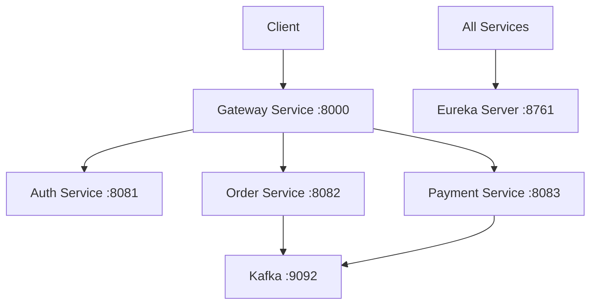

# Order Payment Microservices

주문과 결제를 처리하는 마이크로서비스 기반 시스템입니다.

## 시스템 아키텍처

### 서비스 구성
- **Gateway Service** (Port: 8000)
  - API Gateway
  - 라우팅 및 로드밸런싱
  - Cross-Cutting Concerns 처리

- **Eureka Server** (Port: 8761)
  - 서비스 등록 및 발견
  - 헬스 체크

- **Auth Service** (Port: 8081)
  - 사용자 인증 및 인가
  - JWT 토큰 관리
  - 사용자 관리

- **Order Service** (Port: 8082)
  - 주문 생성 및 관리
  - 주문 상태 추적

- **Payment Service** (Port: 8083)
  - 결제 처리
  - 결제 상태 관리
  - 결제 이력 관리

## 기술 스택

### 공통
- Java 11
- Spring Boot 2.7.12
- Spring Cloud
- Gradle
- MySQL 8.0
- Kafka

### 보안
- Spring Security
- JWT 기반 인증
- Role 기반 권한 관리

## 주요 기능 및 구현

### 1. 서비스 디스커버리 (Eureka)

모든 마이크로서비스는 Eureka Server에 자동 등록되며, 서비스 간 통신은 서비스 이름을 통해 이루어집니다.

### 2. 이벤트 기반 통신 (Kafka)

서비스 간 비동기 통신을 위해 Kafka를 사용합니다.

#### 토픽 구성
- `order-events`: 주문 관련 이벤트
- `payment-events`: 결제 관련 이벤트

#### 이벤트 포맷
```json
{
  "eventId": "uuid",
  "eventType": "EVENT_TYPE",
  "timestamp": "2024-01-01T00:00:00Z",
  "payload": {
    // 이벤트별 페이로드
  }
}
```

### 3. 데이터베이스 구성

각 서비스는 독립적인 데이터베이스를 사용합니다:

- **Auth Service**: `authdb`
  - Users
  - Roles
  - User_roles
  - Auth_tokens

- **Order Service**: `orderdb`
  - Orders
  - Order_items
  - Order_status_history

- **Payment Service**: `paymentdb`
  - Payments
  - Payment_methods
  - Payment_history

### 4. API 문서화

Swagger/OpenAPI를 통해 API 문서화가 제공됩니다:
- Gateway: `http://localhost:8000/swagger-ui.html`
- Auth: `http://localhost:8081/swagger-ui.html`
- Order: `http://localhost:8082/swagger-ui.html`
- Payment: `http://localhost:8083/swagger-ui.html`

## 환경 변수

| 변수명 | 설명 | 기본값 |
|--------|------|--------|
| `MYSQL_HOST` | MySQL 호스트 | localhost |
| `MYSQL_PORT` | MySQL 포트 | 3306 |
| `KAFKA_BROKERS` | Kafka 브로커 목록 | localhost:9092 |

## 빌드 및 실행

1. 프로젝트 빌드:
   ```bash
   ./gradlew clean build
   ```

2. 서비스 실행 순서:
   ```bash
   # 1. Service Discovery (Eureka)
   ./gradlew :eureka-server:bootRun

   # 2. Auth Service
   ./gradlew :auth-service:bootRun

   # 3. Order Service
   ./gradlew :order-service:bootRun

   # 4. Payment Service
   ./gradlew :payment-service:bootRun

   # 5. Gateway Service
   ./gradlew :gateway-service:bootRun
   ```

## 모니터링 및 관리

### Actuator Endpoints
각 서비스는 다음 Actuator 엔드포인트를 제공합니다:
- `/actuator/health`: 서비스 헬스 체크
- `/actuator/info`: 서비스 정보
- `/actuator/metrics`: 메트릭 정보

### 로깅
- 로그 레벨은 application.yml에서 구성
- 기본적으로 INFO 레벨 사용
- 운영 환경에서는 ELK 스택 연동 권장

## 서비스 구성도


## 서비스 포트 구성

| 서비스 | 포트 | 엔드포인트 | 설명 |
|--------|------|------------|------|
| Gateway Service | 8000 | / | API Gateway |
| Eureka Server | 8761 | /eureka | 서비스 디스커버리 |
| Auth Service | 8081 | /api/auth/**, /api/users/** | 인증 및 사용자 관리 |
| Order Service | 8082 | /api/orders/** | 주문 관리 |
| Payment Service | 8083 | /api/payments/** | 결제 처리 |
| Kafka | 9092 | - | 메시지 브로커 |
| Zookeeper | 2181 | - | Kafka 클러스터 관리 |

## 시작하기

1. 저장소 클론:
```bash
git clone https://github.com/yongchulShin/order-payment-ms.git
cd order-payment-ms
```

2. 도커 컴포즈로 인프라 서비스 시작:
```bash
docker-compose up -d
```

3. 각 서비스 실행:
```bash
# 1. Service Discovery (Eureka)
./gradlew :eureka-server:bootRun

# 2. Auth Service
./gradlew :auth-service:bootRun

# 3. Order Service
./gradlew :order-service:bootRun

# 4. Payment Service
./gradlew :payment-service:bootRun

# 5. Gateway Service
./gradlew :gateway-service:bootRun
```

