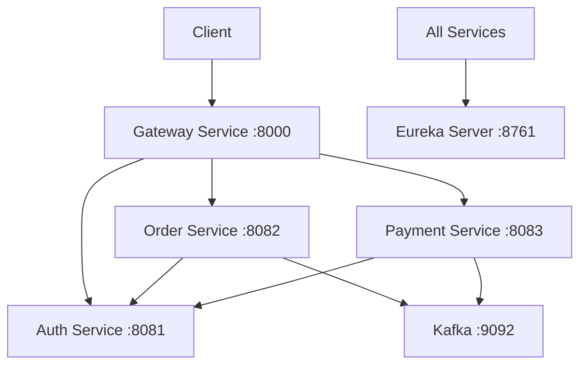
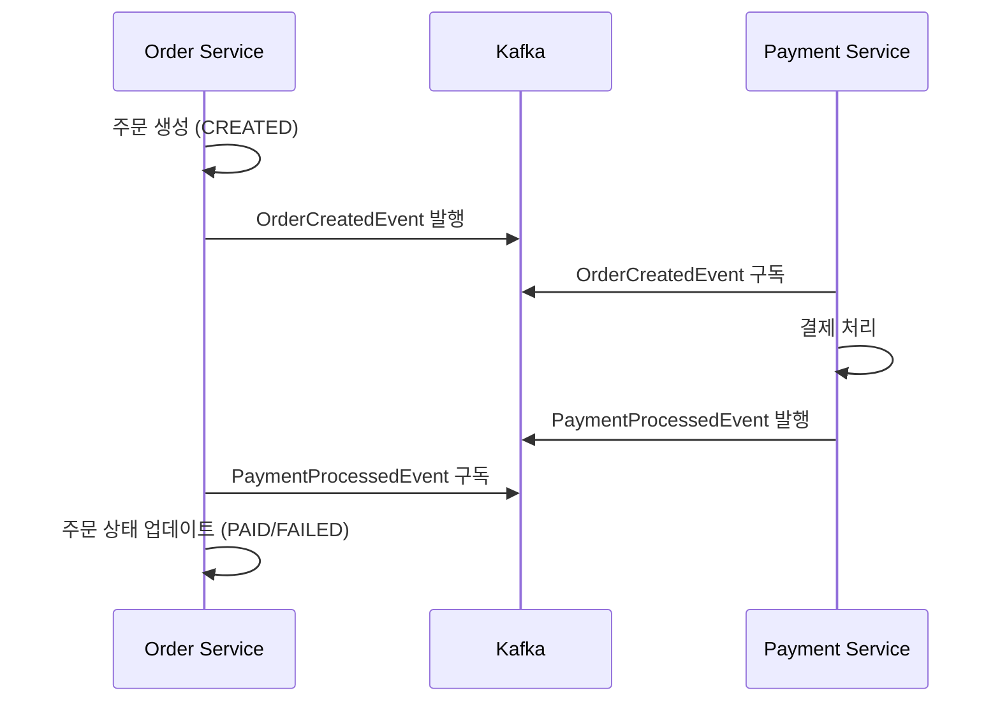

# Order Payment Microservices

주문과 결제를 처리하는 마이크로서비스 기반 시스템입니다.

## 시스템 아키텍처

### 서비스 구성
- **Gateway Service** (Port: 8000)
  - API Gateway
  - 라우팅 및 로드밸런싱
  - Cross-Cutting Concerns 처리

- **Auth Service** (Port: 8081)
  - 사용자 인증/인가
  - JWT 토큰 관리
  - 사용자 계정 관리

- **Order Service** (Port: 8082)
  - 주문 생성 및 관리
  - 주문 상태 추적
  - 결제 요청 발행

- **Payment Service** (Port: 8083)
  - 결제 처리
  - 결제 상태 관리
  - 결제 이력 관리

- **Service Discovery** (Eureka Server) (Port: 8761)
  - 서비스 등록 및 발견
  - 헬스 체크

## 기술 스택

### 공통
- Java 11
- Spring Boot 2.7.12
- Spring Cloud
- Gradle
- MySQL 8.0
- Kafka

### 보안
- Spring Security
- JWT (JSON Web Token)
- 중앙화된 보안 설정 (common-lib)

## 주요 기능 및 구현

### 1. 보안 자동 구성 (Security Auto Configuration)

프로젝트는 `common-lib`을 통해 중앙화된 보안 설정을 제공합니다. 이는 Spring Boot의 Auto Configuration 메커니즘을 활용합니다.

#### Auto Configuration 구조
```
common-lib/
├── src/main/java/
│   └── com/example/commonlib/
│       ├── config/
│       │   ├── SecurityAutoConfiguration.java
│       │   └── JwtProperties.java
│       └── security/
│           ├── JwtAuthenticationFilter.java
│           └── JwtTokenProvider.java
└── src/main/resources/
    └── META-INF/
        └── spring.factories
```

#### spring.factories 설정
```properties
org.springframework.boot.autoconfigure.EnableAutoConfiguration=\
com.example.commonlib.config.SecurityAutoConfiguration
```

#### 자동 구성되는 컴포넌트
- `JwtTokenProvider`: JWT 토큰 생성 및 검증
- `JwtAuthenticationFilter`: 요청의 JWT 토큰 처리
- `SecurityFilterChain`: 보안 필터 체인 구성

#### 사용 방법
1. 의존성 추가:
   ```gradle
   implementation project(':common-lib')
   ```

2. JWT 설정 추가 (application.yml):
   ```yaml
   jwt:
     secret: ${JWT_SECRET:your-secret-key}
   ```

3. 메인 클래스에 설정 활성화:
   ```java
   @EnableConfigurationProperties(JwtProperties.class)
   ```

### 2. 이벤트 기반 통신 (Kafka)

서비스 간 비동기 통신을 위해 Kafka를 사용합니다.

#### 토픽 구성
- `order-created`: 주문 생성 이벤트
- `payment-completed`: 결제 완료 이벤트
- `payment-failed`: 결제 실패 이벤트

#### 이벤트 포맷
```json
{
  "eventId": "uuid",
  "eventType": "ORDER_CREATED",
  "timestamp": "2024-01-01T00:00:00Z",
  "payload": {
    // 이벤트별 페이로드
  }
}
```

### 3. 데이터베이스 구성

각 서비스는 독립적인 데이터베이스를 사용합니다:

- **Auth Service**: `auth_service`
  - Users
  - Roles
  - Auth_tokens

- **Order Service**: `orderdb`
  - Orders
  - Order_items
  - Order_status_history

- **Payment Service**: `paymentdb`
  - Payments
  - Payment_methods
  - Payment_history

### 4. API 문서화

Swagger/OpenAPI를 통해 API 문서화가 제공됩니다:
- Gateway: `http://localhost:8000/swagger-ui.html`
- Auth: `http://localhost:8081/swagger-ui.html`
- Order: `http://localhost:8082/swagger-ui.html`
- Payment: `http://localhost:8083/swagger-ui.html`

## 환경 변수

| 변수명 | 설명 | 기본값 |
|--------|------|--------|
| `JWT_SECRET` | JWT 서명 키 | 미리 정의된 키 |
| `MYSQL_HOST` | MySQL 호스트 | localhost |
| `MYSQL_PORT` | MySQL 포트 | 3306 |
| `KAFKA_BROKERS` | Kafka 브로커 목록 | localhost:9092 |

## 빌드 및 실행

1. 프로젝트 빌드:
   ```bash
   ./gradlew clean build
   ```

2. 서비스 실행 순서:
   ```bash
   # 1. Service Discovery (Eureka)
   ./gradlew :eureka-server:bootRun

   # 2. Auth Service
   ./gradlew :auth-service:bootRun

   # 3. Order Service
   ./gradlew :order-service:bootRun

   # 4. Payment Service
   ./gradlew :payment-service:bootRun

   # 5. Gateway Service
   ./gradlew :gateway-service:bootRun
   ```

## 모니터링 및 관리

### Actuator Endpoints
각 서비스는 다음 Actuator 엔드포인트를 제공합니다:
- `/actuator/health`: 서비스 헬스 체크
- `/actuator/info`: 서비스 정보
- `/actuator/metrics`: 메트릭 정보

### 로깅
- 로그 레벨은 application.yml에서 구성
- 기본적으로 INFO 레벨 사용
- 운영 환경에서는 ELK 스택 연동 권장

## 확장 및 커스터마이징

### 보안 설정 커스터마이징
각 서비스에서 SecurityConfig를 구성하여 기본 설정을 오버라이드할 수 있습니다:

```java
@Configuration
@EnableWebSecurity
public class CustomSecurityConfig {
    @Bean
    public SecurityFilterChain filterChain(HttpSecurity http) {
        // 커스텀 보안 설정
    }
}
```

### 이벤트 핸들러 추가
새로운 이벤트 핸들러는 다음과 같이 구현:

```java
@KafkaListener(topics = "new-topic")
public void handleNewEvent(EventMessage event) {
    // 이벤트 처리 로직
}
```

## 서비스 구성도


## 서비스 포트 구성

| 서비스 | 포트 | 엔드포인트 | 설명 |
|--------|------|------------|------|
| Gateway Service | 8000 | / | API Gateway |
| Eureka Server | 8761 | /eureka | 서비스 디스커버리 |
| Auth Service | 8081 | /api/auth/**, /api/users/** | 인증 및 사용자 관리 |
| Order Service | 8082 | /api/orders/** | 주문 관리 |
| Payment Service | 8083 | /api/payments/** | 결제 처리 |
| Kafka | 9092 | - | 메시지 브로커 |
| Zookeeper | 2181 | - | Kafka 클러스터 관리 |

## 시작하기

1. 저장소 클론:
```bash
git clone https://github.com/yongchulShin/order-payment-ms.git
cd order-payment-ms
```

2. 도커 컴포즈로 실행:
```bash
docker-compose up -d
```

3. 서비스 접속:
- API Gateway: http://localhost:8000
- Eureka Server: http://localhost:8761
- Auth Service: http://localhost:8081 (인증 및 사용자 관리)
- Order Service: http://localhost:8082 (주문 관리)
- Payment Service: http://localhost:8083 (결제 처리)

## API 문서
각 서비스의 API 문서는 Swagger UI를 통해 확인할 수 있습니다:
- Auth Service: http://localhost:8081/swagger-ui.html
- Order Service: http://localhost:8082/swagger-ui.html
- Payment Service: http://localhost:8083/swagger-ui.html

## 기술 스택

- **프레임워크**: Spring Boot, Spring Cloud
- **보안**: Spring Security with JWT
- **데이터베이스**: MySQL
- **메시지 브로커**: Apache Kafka
- **서비스 디스커버리**: Netflix Eureka
- **API Gateway**: Spring Cloud Gateway
- **컨테이너화**: Docker
- **빌드 도구**: Gradle

## 주요 기능

### 인증 및 보안
- JWT 기반 인증
- 액세스 토큰 (5분 유효)
- 리프레시 토큰 (1개월 유효)
- 리프레시 토큰 교체(RTR) 메커니즘
- 역할 기반 접근 제어

### 주문 관리
- 주문 생성 및 추적
- 주문 상태 관리
- 주문 항목 처리
- 실시간 주문 업데이트

### 결제 처리
- 안전한 결제 처리
- 결제 상태 추적
- 결제 내역
- 트랜잭션 관리

### 이벤트 기반 아키텍처
- Kafka 기반 이벤트 통신
- 비동기 처리
- 중요 작업에 대한 이벤트 소싱

#### 이벤트 흐름
주문-결제 프로세스는 다음과 같은 이벤트 흐름을 따릅니다:



1. **주문 생성 이벤트**
   - Order Service에서 주문 생성 시 `order-created` 토픽으로 이벤트 발행
   - 이벤트 데이터: 주문ID, 사용자ID, 총액(BigDecimal)

2. **결제 처리 이벤트**
   - Payment Service에서 결제 처리 후 `payment-processed` 토픽으로 이벤트 발행
   - 이벤트 데이터: 주문ID, 결제ID, 금액(BigDecimal), 상태(SUCCESS/FAILED), 실패 사유

3. **주문 상태 흐름**
   - CREATED: 주문 생성 시
   - PENDING: 결제 대기 상태
   - PAID: 결제 완료 상태
   - COMPLETED: 주문 처리 완료 상태
   - FAILED: 결제 실패 상태
   - CANCELLED: 주문 취소 상태

4. **에러 처리**
   - 결제 실패 시 자동 실패 처리
   - 상세 실패 사유 기록
   - 실패 이벤트를 통한 상태 동기화

5. **데이터 정확성**
   - 모든 금액은 BigDecimal 사용
   - 주문 금액, 결제 금액, 상품 가격 등 정확한 계산 보장
   - 반올림 오류 방지

## 보안 고려사항

- 모든 민감한 데이터 암호화
- 토큰 안전한 저장 및 관리
- 역할 기반 접근 제어 구현
- 서비스 간 보안 통신
- API 엔드포인트 요청 제한

## 모니터링 및 로깅

- 중앙 집중식 로깅 시스템
- 성능 메트릭 수집
- 서비스 상태 모니터링
- 트랜잭션 추적

## 기여하기

1. 저장소 포크
2. 기능 브랜치 생성
3. 변경사항 커밋
4. 브랜치에 푸시
5. Pull Request 생성

