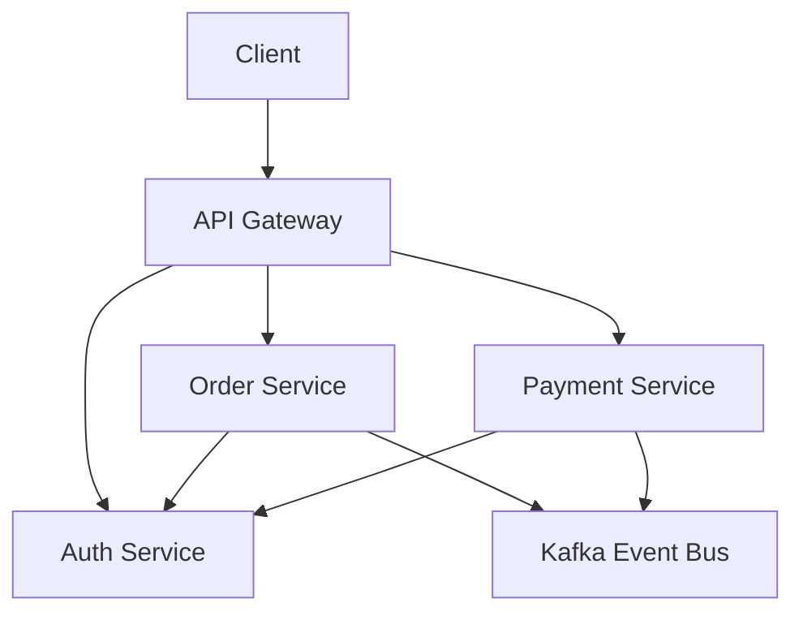
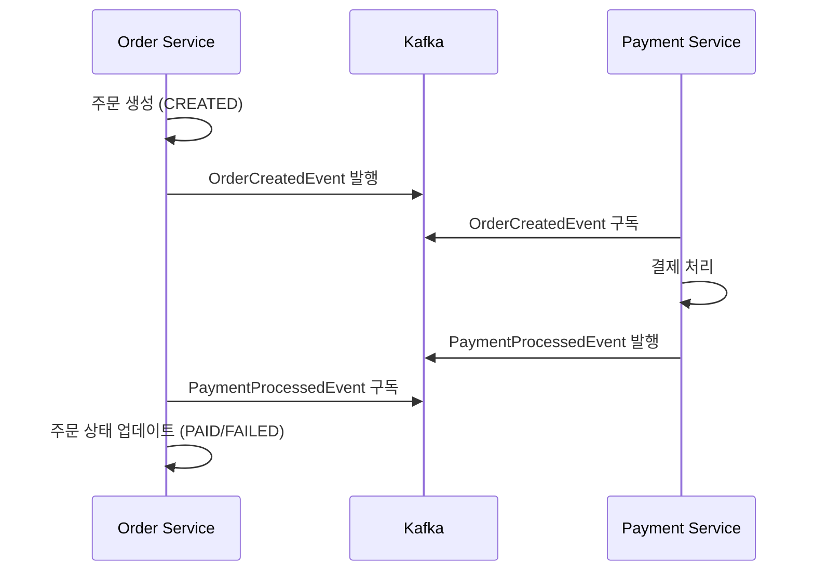

# 주문-결제 마이크로서비스 시스템

사용자 인증 및 권한 부여가 포함된 견고한 마이크로서비스 기반 주문-결제 시스템입니다.

## 서비스 구조

### 1. Auth Service
- 사용자 인증 및 인가
- 회원 관리 (가입, 수정, 조회)
- JWT 토큰 관리
- 사용자 권한 관리
- 프로필 관리

### 2. Order Service
- 주문 생성 및 관리
- 주문 상태 관리
- 주문 이력 조회
- 주문 이벤트 발행

### 3. Payment Service
- 결제 처리
- 결제 상태 관리
- 결제 이력 조회
- 결제 이벤트 발행

### 4. Common Library
- 공통 DTO
- 이벤트 메시지
- 유틸리티 클래스
- 공통 예외 처리

## 서비스 간 통신


### 인증 흐름
1. 클라이언트가 Auth Service를 통해 로그인
2. JWT 토큰 발급
3. 토큰을 사용하여 다른 서비스 접근
4. Auth Service에서 사용자 정보 및 권한 검증

## 기술 스택

- **프레임워크**: Spring Boot, Spring Cloud
- **보안**: Spring Security with JWT
- **데이터베이스**: MySQL
- **메시지 브로커**: Apache Kafka
- **서비스 디스커버리**: Netflix Eureka
- **API Gateway**: Spring Cloud Gateway
- **컨테이너화**: Docker
- **빌드 도구**: Gradle

## 주요 기능

### 인증 및 보안
- JWT 기반 인증
- 액세스 토큰 (5분 유효)
- 리프레시 토큰 (1개월 유효)
- 리프레시 토큰 교체(RTR) 메커니즘
- 역할 기반 접근 제어

### 주문 관리
- 주문 생성 및 추적
- 주문 상태 관리
- 주문 항목 처리
- 실시간 주문 업데이트

### 결제 처리
- 안전한 결제 처리
- 결제 상태 추적
- 결제 내역
- 트랜잭션 관리

### 이벤트 기반 아키텍처
- Kafka 기반 이벤트 통신
- 비동기 처리
- 중요 작업에 대한 이벤트 소싱

#### 이벤트 흐름
주문-결제 프로세스는 다음과 같은 이벤트 흐름을 따릅니다:



1. **주문 생성 이벤트**
   - Order Service에서 주문 생성 시 `order-created` 토픽으로 이벤트 발행
   - 이벤트 데이터: 주문ID, 사용자ID, 총액(BigDecimal)

2. **결제 처리 이벤트**
   - Payment Service에서 결제 처리 후 `payment-processed` 토픽으로 이벤트 발행
   - 이벤트 데이터: 주문ID, 결제ID, 금액(BigDecimal), 상태(SUCCESS/FAILED), 실패 사유

3. **주문 상태 흐름**
   - CREATED: 주문 생성 시
   - PENDING: 결제 대기 상태
   - PAID: 결제 완료 상태
   - COMPLETED: 주문 처리 완료 상태
   - FAILED: 결제 실패 상태
   - CANCELLED: 주문 취소 상태

4. **에러 처리**
   - 결제 실패 시 자동 실패 처리
   - 상세 실패 사유 기록
   - 실패 이벤트를 통한 상태 동기화

5. **데이터 정확성**
   - 모든 금액은 BigDecimal 사용
   - 주문 금액, 결제 금액, 상품 가격 등 정확한 계산 보장
   - 반올림 오류 방지

## 시작하기

### 사전 요구사항
- JDK 11
- Docker 및 Docker Compose
- MySQL
- Apache Kafka

### 설치 방법

1. 저장소 클론:
```bash
git clone https://github.com/yongchulShin/order-payment-ms.git
cd order-payment-ms
```

2. 인프라 서비스 시작:
```bash
docker-compose up -d
```

3. 서비스 빌드 및 실행:
```bash
./gradlew build
```

4. 서비스 접속 주소:
- Eureka Server: http://localhost:8761
- API Gateway: http://localhost:8080
- Auth Service: http://localhost:8081
- User Service: http://localhost:8082
- Order Service: http://localhost:8083
- Payment Service: http://localhost:8084

## API 문서

### 인증 엔드포인트
- POST /api/auth/signup - 회원가입
- POST /api/auth/login - 로그인
- POST /api/auth/refresh - 액세스 토큰 갱신
- POST /api/auth/logout - 로그아웃

### 사용자 엔드포인트
- GET /api/users - 사용자 목록 조회
- GET /api/users/{id} - 사용자 상세 조회
- PUT /api/users/{id} - 사용자 정보 수정
- DELETE /api/users/{id} - 사용자 삭제

### 주문 엔드포인트
- POST /api/orders - 주문 생성
- GET /api/orders - 주문 목록 조회
- GET /api/orders/{id} - 주문 상세 조회
- PUT /api/orders/{id} - 주문 수정
- DELETE /api/orders/{id} - 주문 취소

### 결제 엔드포인트
- POST /api/payments - 결제 처리
- GET /api/payments - 결제 목록 조회
- GET /api/payments/{id} - 결제 상세 조회
- GET /api/payments/history - 결제 내역 조회

## 설정

각 서비스는 다음과 같은 설정을 포함하는 application.yml 파일을 가집니다:
- 데이터베이스 연결
- Kafka 설정
- 보안 매개변수
- 서비스 디스커버리
- 로깅 레벨

## 보안 고려사항

- 모든 민감한 데이터 암호화
- 토큰 안전한 저장 및 관리
- 역할 기반 접근 제어 구현
- 서비스 간 보안 통신
- API 엔드포인트 요청 제한

## 모니터링 및 로깅

- 중앙 집중식 로깅 시스템
- 성능 메트릭 수집
- 서비스 상태 모니터링
- 트랜잭션 추적

## 기여하기

1. 저장소 포크
2. 기능 브랜치 생성
3. 변경사항 커밋
4. 브랜치에 푸시
5. Pull Request 생성

## 라이선스

이 프로젝트는 MIT 라이선스를 따릅니다 - 자세한 내용은 LICENSE 파일을 참조하세요.

## 서비스 포트 구성

| 서비스 | 포트 | 설명 |
|--------|------|------|
| Gateway Service | 8000 | API Gateway |
| Eureka Server | 8761 | 서비스 디스커버리 |
| Auth Service | 8081 | 인증 및 사용자 관리 |
| Order Service | 8082 | 주문 관리 |
| Payment Service | 8083 | 결제 처리 |
| Kafka | 9092 | 메시지 브로커 |
| Zookeeper | 2181 | Kafka 클러스터 관리 |
