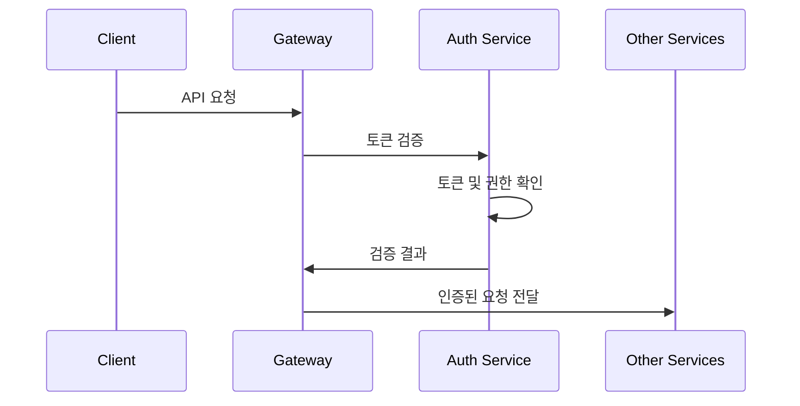

# 기술 검토 문서

## 시스템 아키텍처 검토

### 마이크로서비스 구조
시스템은 명확한 관심사 분리를 가진 잘 설계된 마이크로서비스 아키텍처를 따릅니다:
- **Eureka Server**: 효과적인 서비스 디스커버리 처리
- **API Gateway**: 중앙화된 라우팅 및 횡단 관심사 제공
- **Auth Service**: JWT를 통한 견고한 보안 구현
- **User Service**: 깔끔한 사용자 관리 기능
- **Order Service**: 효율적인 주문 처리
- **Payment Service**: 안전한 결제 처리

#### Gradle 멀티 프로젝트 설정
```gradle
// Root build.gradle
buildscript {
    ext {
        springBootVersion = '2.7.12'
        springCloudVersion = '2021.0.8'
    }
}

plugins {
    id 'org.springframework.boot' version "${springBootVersion}" apply false
    id 'io.spring.dependency-management' version '1.0.15.RELEASE' apply false
    id 'java'
}

subprojects {
    apply plugin: 'java'
    apply plugin: 'org.springframework.boot'
    apply plugin: 'io.spring.dependency-management'

    dependencies {
        implementation 'org.springframework.boot:spring-boot-starter-web'
        implementation 'org.springframework.cloud:spring-cloud-starter-netflix-eureka-client'
        compileOnly 'org.projectlombok:lombok'
    }
}
```

### 통신 패턴
1. **동기 통신**
   - 서비스 간 직접 통신을 위한 REST API
   - 클라이언트 요청을 위한 API Gateway 라우팅
   - 장애 허용을 위한 서킷 브레이커

2. **비동기 통신**
   - Kafka 기반 이벤트 기반 아키텍처
   - 중요 작업을 위한 이벤트 소싱
   - 적절한 이벤트 처리 및 오류 복구

## 보안 구현

### JWT 인증
- 액세스 토큰(5분) 및 리프레시 토큰(1개월)
- 향상된 보안을 위한 리프레시 토큰 교체(RTR)
- 안전한 토큰 저장 및 전송
- 적절한 토큰 검증 및 오류 처리

#### JWT 설정 예시
```java
// JwtProperties.java
@Component
@ConfigurationProperties(prefix = "jwt")
@Getter @Setter
public class JwtProperties {
    private String secret;
    private long accessTokenValidityInSeconds = 300; // 5 minutes
    private long refreshTokenValidityInSeconds = 2592000; // 30 days
}

// SecurityConfig.java
@Configuration
@EnableWebSecurity
@RequiredArgsConstructor
public class SecurityConfig {
    private final JwtTokenProvider tokenProvider;

    @Bean
    public SecurityFilterChain filterChain(HttpSecurity http) throws Exception {
        http
            .csrf().disable()
            .sessionManagement().sessionCreationPolicy(SessionCreationPolicy.STATELESS)
            .and()
            .authorizeRequests()
            .antMatchers("/api/auth/**").permitAll()
            .anyRequest().authenticated()
            .and()
            .addFilterBefore(new JwtAuthenticationFilter(tokenProvider),
                    UsernamePasswordAuthenticationFilter.class);
        return http.build();
    }
}

// JwtTokenProvider.java
@Component
public class JwtTokenProvider {
    public String createAccessToken(Authentication authentication) {
        long now = (new Date()).getTime();
        Date validity = new Date(now + jwtProperties.getAccessTokenValidityInSeconds() * 1000);

        return Jwts.builder()
                .setSubject(authentication.getName())
                .claim("userId", ((TokenInfo) authentication.getPrincipal()).getUserId())
                .claim("roles", authentication.getAuthorities().stream()
                        .map(GrantedAuthority::getAuthority)
                        .collect(Collectors.toList()))
                .signWith(key, SignatureAlgorithm.HS512)
                .setExpiration(validity)
                .compact();
    }
}
```

### 권한 부여
- 역할 기반 접근 제어(RBAC)
- 세분화된 권한 시스템
- 안전한 엔드포인트 보호
- API Gateway 수준의 보안

## 데이터베이스 설계

### 스키마 설계
- 적절한 정규화
- 효율적인 인덱싱
- 적절한 관계 설정
- 최적화된 쿼리 성능

### 데이터 관리
- 트랜잭션 관리
- 데이터 일관성
- 적절한 오류 처리
- 감사 로깅

## 이벤트 기반 아키텍처

### Kafka 구현
- 토픽 설계 및 파티셔닝
- 컨슈머 그룹 관리
- 데드 레터 큐
- 이벤트 재시도 메커니즘

#### 이벤트 흐름 상세
1. **주문 생성 → 결제 처리**
   ```mermaid
   sequenceDiagram
       participant OS as Order Service
       participant K as Kafka
       participant PS as Payment Service
       
       OS->>OS: 주문 생성 (CREATED)
       OS->>K: OrderCreatedEvent 발행
       PS->>K: OrderCreatedEvent 구독
       PS->>PS: 결제 처리
       PS->>K: PaymentProcessedEvent 발행
       OS->>K: PaymentProcessedEvent 구독
       OS->>OS: 주문 상태 업데이트 (PAID/FAILED)
   ```

2. **이벤트 메시지 구조**
   ```java
   // OrderCreatedEvent.java
   @Data
   @AllArgsConstructor
   public class OrderCreatedEvent {
       private Long orderId;
       private Long userId;
       private BigDecimal totalAmount;  // 정확한 금액 계산을 위해 BigDecimal 사용
   }

   // PaymentProcessedEvent.java
   @Data
   @AllArgsConstructor
   public class PaymentProcessedEvent {
       private Long orderId;
       private Long paymentId;
       private BigDecimal amount;      // 정확한 금액 계산을 위해 BigDecimal 사용
       private String status;          // SUCCESS, FAILED
       private String failureReason;   // 실패 시 사유
   }
   ```

3. **주문 상태 관리**
   ```java
   // OrderStatus.java
   public enum OrderStatus {
       CREATED,    // 주문이 처음 생성된 상태
       PENDING,    // 결제 대기 상태
       PAID,       // 결제 완료 상태
       COMPLETED,  // 주문 처리 완료 상태
       FAILED,     // 결제 실패 상태
       CANCELLED   // 주문 취소 상태
   }

   // PaymentStatus.java
   public enum PaymentStatus {
       PENDING,    // 결제 대기 상태
       SUCCESS,    // 결제 성공
       FAILED      // 결제 실패
   }
   ```

4. **이벤트 처리 구현**
   ```java
   // OrderProducer.java
   @Component
   @RequiredArgsConstructor
   public class OrderProducer {
       private final KafkaTemplate<String, OrderCreatedEvent> kafkaTemplate;
       private static final String ORDER_CREATED_TOPIC = "order-created";

       public void sendOrderCreatedEvent(Order order) {
           OrderCreatedEvent event = new OrderCreatedEvent(
               order.getId(),
               order.getUserId(),
               order.getTotalAmount()  // BigDecimal
           );
           kafkaTemplate.send(ORDER_CREATED_TOPIC, event);
       }
   }

   // PaymentEventConsumer.java
   @Component
   @RequiredArgsConstructor
   public class PaymentEventConsumer {
       private final PaymentService paymentService;

       @KafkaListener(topics = "payment-processed")
       public void handlePaymentProcessedEvent(PaymentProcessedEvent event) {
           if ("SUCCESS".equals(event.getStatus())) {
               orderService.completeOrder(event.getOrderId(), event.getPaymentId());
           } else {
               orderService.failOrder(event.getOrderId(), event.getFailureReason());
           }
       }
   }
   ```

5. **데이터 정확성 보장**
   - 모든 금액 관련 필드에 BigDecimal 사용
   ```java
   public class Order {
       private BigDecimal totalAmount;
   }

   public class OrderItem {
       private BigDecimal price;
       private BigDecimal subtotal;
   }

   public class Payment {
       private BigDecimal amount;
   }
   ```

6. **에러 처리 및 복구**
   - 결제 실패 시 자동 실패 처리
   - 상세한 실패 사유 기록
   - 실패 이벤트를 통한 상태 동기화
   - 트랜잭션 롤백 처리

7. **모니터링 및 추적**
   - 각 서비스의 이벤트 처리 로깅
   - 결제 처리 상태 추적
   - 실패한 트랜잭션 모니터링
   - 성능 메트릭 수집

## 코드 품질

### 모범 사례
- SOLID 원칙 준수
- 클린 코드 원칙
- 적절한 예외 처리
- 포괄적인 로깅

### 테스팅
- 단위 테스트
- 통합 테스트
- 엔드투엔드 테스트
- 성능 테스트

## 성능 고려사항

### 확장성
- 수평적 확장 능력
- 부하 분산
- 캐싱 전략
- 데이터베이스 최적화

### 모니터링
- 상태 확인
- 성능 메트릭
- 로그 집계
- 경고 시스템

## 개선 영역

### 단기 개선사항
1. **캐싱 구현**
   - 자주 접근하는 데이터를 위한 Redis 추가
   - 캐시 무효화 전략 구현

2. **API 문서화**
   - Swagger/OpenAPI 문서 개선
   - API 버전 관리 추가

3. **테스트 커버리지**
   - 단위 테스트 커버리지 증가
   - 통합 테스트 추가

### 장기 개선사항
1. **관찰 가능성**
   - 분산 추적 구현
   - 향상된 모니터링 대시보드
   - 더 나은 오류 추적

2. **성능**
   - 데이터베이스 샤딩 구현
   - 쿼리 성능 최적화
   - 캐싱 계층 추가

3. **보안**
   - 정기적인 보안 감사
   - 침투 테스트
   - 보안 준수 검사

## 배포 전략

### 현재 설정
- Docker 컨테이너화
- 로컬 개발을 위한 Docker Compose
- 환경별 구성

### 향후 권장사항
1. **Kubernetes 배포**
   - 컨테이너 오케스트레이션
   - 자동 확장
   - 롤링 업데이트
   - 상태 모니터링

2. **CI/CD 파이프라인**
   - 자동화된 테스팅
   - 품질 게이트
   - 자동화된 배포
   - 환경 승격

## 유지보수 지침

### 모니터링
1. **서비스 상태**
   - 정기적인 상태 확인
   - 성능 모니터링
   - 오류율 추적
   - 리소스 사용량

2. **보안**
   - 토큰 검증
   - 접근 패턴
   - 인증 시도
   - 보안 위반


## 결론

주문-결제 마이크로서비스 시스템은 다음과 같은 특징을 가진 잘 설계된 솔루션을 보여줍니다:
- 견고한 보안 구현
- 확장 가능한 마이크로서비스 아키텍처
- 효율적인 이벤트 기반 통신
- 적절한 오류 처리 및 복구
- 포괄적인 모니터링 기능

<<<<<<< HEAD
현재 구현은 견고하지만, 제안된 개선사항들은 시스템의 신뢰성, 보안성 및 성능을 더욱 향상시킬 것입니다. 

## 서비스 아키텍처

### 서비스 구성
1. **Auth Service**
   - 사용자 인증 및 인가
   - 회원 관리 기능 통합
   - JWT 기반 토큰 관리
   - 사용자 프로필 관리
   - 권한 기반 접근 제어

2. **Order Service**
   - 주문 생성 및 관리
   - 주문 상태 관리
   - Kafka 이벤트 발행
   - 결제 결과 처리

3. **Payment Service**
   - 결제 처리
   - 결제 상태 관리
   - Kafka 이벤트 발행
   - 결제 이력 관리

4. **Common Library**
   - 공통 DTO 클래스
   - 이벤트 메시지 정의
   - 공통 유틸리티
   - 예외 처리 표준화

### 인증 및 권한


1. **토큰 기반 인증**
   - JWT 사용
   - Access Token / Refresh Token
   - 토큰 만료 관리

2. **권한 관리**
   - Role 기반 접근 제어
   - API 엔드포인트 보호
   - 서비스 간 인증 
=======
제안된 개선사항들은 시스템의 신뢰성, 보안성 및 성능을 더욱 향상시킬 것입니다. 
>>>>>>> 777cdae95a2ee8053b700303be7ad0ac7c274719
